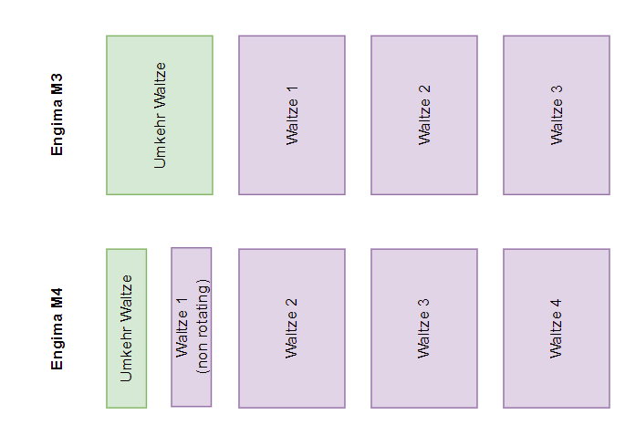
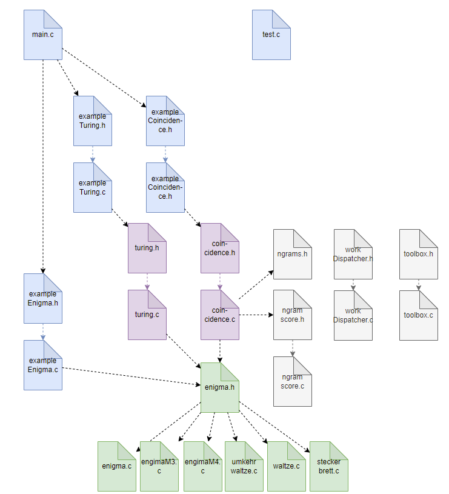

# enigma_c - Enigma simulation in C
## Introduction
### Purpose
This code simulates the Engima M3 and M4 encryption machine the Germans used during WWII.
I wrote this software to study the Enigma and try to crack its cyphers. It
is not meant as a user friendly program and requires C programming skills.


Engima M3 (picture link from site https://www.stephenpeek.co.uk)

The core of the software is mainly intended for research and to be used to break Enigma encoded cyphers and study its workings. It is intended for **software devolopers who are familiar with the C language**. To show its workings, a lot of examples are provide which can be run from the menu. It is not intended as some stand alone end user tool. 

### Performance
My first implementation was in Java (https://github.com/scubajorgen/enigma). Though nowadays Java is my favorite language, its performance was poor for some brute forcing because of the nature of the language. 
Therefore I wrote the software also in plain old C and optimized for performance. 

On a simple low power Pentium it peforms 50.000-80.000 encryptions per second (running on 6 threads), whereas the Java software on a I5 notebook 
performs only 1000 or so. On a Linux VM on the Core I5-9600 @ 3.7 GHz it runs 200.000 - 300.000 decryptions per second (depending on the text size). 

## Building
The software requires Linux and gcc.
Simply call 'make clean', 'make'.
It delivers two executable files:
* **enigma**, which executes a number of examples and demos on request
* **test**, which execute module tests

Run it as 
```
./enigma
```

## Usage of the software

Next code example shows how to create an Enigma, configure it, encode/decode and destory it:
```    
    enigma=createEnigmaM3();
    setText(enigma, "RCGXFEAJCT");
    placeWaltze(enigma, 1, "I");
    placeWaltze(enigma, 2, "II");
    placeWaltze(enigma, 3, "III");
    
    placeUmkehrWaltze(enigma, "UKW B");
    
    setRingStellung(enigma, 1, 1);
    setRingStellung(enigma, 2, 17);
    setRingStellung(enigma, 3, 12);

    setGrundStellung(enigma, 1, 'A');
    setGrundStellung(enigma, 2, 'B');
    setGrundStellung(enigma, 3, 'C');
    
    placeSteckers(enigma, "bq cr di ej kw mt os px uz gh");
    
    encodeDecode(enigma);

    result=toString(enigma);
    destroyEngima(enigma);
```    
Note that the rotors positions are numbered in the regular way from left to right, starting with 1 as shown below. Note that in *these interface functions* for the letters ASCII characters can be used (like 'A', 'B', 'C', ... 'Z', 'a', 'b', ... 'z') as well as digits (1, 2, ... 26).



In the code the internal representation is optimized for performance. Rotor numbering is the other way round (0 for the rightmost fastest rotor, numbering up to the left) and 0..25 for letters. Refer to the code for more information. Rotors are converted to look-up tables, so encryption/decryptions simply boils down to various lookups.

TO DO: convert Ringstellung to change the lookup-tables in order to save more calculations during encryption/decryption. 

## Cracking ciphers: Turing method

The software implements the method used by Alan Turing to crack the German encoded messages using 'the Bombe'. It assumes a piece of plain text (the crib) that corresponds to part of the cypher text. The software creates the letter links (the menu) and finds all loops in it. It then finds the rotor settings and start position that fullfills the loops.
Refer to http://www.rutherfordjournal.org/article030108.html for a good description.

The Turing Bombe crack:

    turingBombe("CYPHERTEXT", "CRIB", 1);

Note:
* Pass the cypher text and the crib as uppercase! 
* Crib length shall not exceed cypher text length. 
* Crib size should not exceed 26 characters or the loop number will explode. Space is not allocated dynamically, so arrays will get out of bounds
* The crib start must correspond to position 0 of the cypher. 
* To use multi core processors increase the number of threads (3rd parameter) to 2, 3 or 4. The routine parses all 60 permutations of 5 rotors and subdivides the work amongst the threads.

Or simply, for a working example:

    turingExample();

The software results in all rotor settings that result in the loops defined by the cypher en crib.

## Cracking cyphers: Index of Coincidence - James Gillogly
### The method
James Gillogly presented a method for finding the rotor settings and the steckers using the '_Index of Coincidence_' (IoC).
It uses the fact that letter frequency in plain text isn't random. He uses the index of coincidence as measure of 'non-randomness'. The Gillogly method consists of following steps:
1. Find the Waltzen and Grundstellung used that result in the largest IoC value, assuming a fixed Ringstellung of 1-1-1. It simply tries all combinations, perform a decryption and calculates the IoC.
1. Find the Ringstellung with the highes IoC value, first by varying the Ringstellung of Rotor 3, then of Rotor 2 (and changing the Grundstellung accordingly).
1. Find the steckers using a  'hill-climbing' technique.

The 1st step is the most time consuming. 

In this software the 2nd step has been improved. In the original method Ringstellung and Grundstellung are simply done not taking into account the inner workings of the Enigma. In this software the working of the Enigma is simulated when changing Ringstellung and Grundstellung (maybe Gillogly did it this way, but it was not described in his article).

See [the original article](http://web.archive.org/web/20060720040135/http://members.fortunecity.com/jpeschel/gillog1.htm) (it is enclosed in the /documents folder as well).
The method described and the original Gillogly cipher is implemented in the example 

```
    iocExample00();
```
Note that the Ringstellung of Waltze 1 has no meaning. R1 G1 results in the same decryption as R2 G2 as R3 G3, etc.

### Modes
Several modes are implemented.
* METHOD_IOC
  The orginal method as described above
* METHOD_IOC_R3
  As above, but now the fastest Waltze 3 is also taken into step 1, at the 
  penalty of more time (26x) being consumed. It sometimes is more successful than the original method and has been proposed by Gillogly. 
* METHOD_IOC_R2R3
  As above, but now both Waltzen 2 and 3 are taken into step 1, removing he necesity for step 2. The penalty with respect to the original is 25x26x more time. It sometimes is more successful than the original method and has been proposed by Gillogly. 
* METHOD_IOC_DEEP
  Experimental method in which also the Stecker finding is taken into step 1. Extremely slowly and not really succesful

### Findings
The implementation distributes the work over a number of threads, so the cores of multi core processors can be used to speed up the work by parallel processing.

The original message from the Gillogly article is decrypted in **9 seconds** on a Core I5-9600 @ 3.7 GHz using method METHOD_IOC.

A drawback of the Gillogly method is that with increasing number of Steckers the chance of decryption decreases. With 10 steckers it goes to 0. 

The chance of finding the right solution decreases with the number of letters in the cipher, since randomness in the IoC become a factor, resulting in other solutions than the right one. Especially when the Ringstellung deviates much from 1-1-1. It may be worthwile to use METHOD_IOC_R3 or METHOD_IOC_R2R3 in such cases.
Assume Ringstellung R3=2 and Grundstellung G3=5 and you assume R3=1 you most probably will find G3=4. This gives almost the same result decryption result, however 1 out of 26 characters is wrong. Similarly if R3=3 and you assume R3=1 you find G3=3 and you end up with the decryption in which 2 out of 26 characters are wrong. In this way, the worst you can get is 13 out of 26 characters wrong, which is half of the text. The IoC than depends on the other half of the text which is right.


## Bgrams, Trigrams, Ngrams
**Under construction**

As an alternative for finding the steckers a method that scores the decoded text using trigrams. The method is described by [this article](https://cryptocellar.org/pubs/bgac.pdf).
After finding the rotor settings and first steckers using the Gillogly method, the method succeeds better in fining the final steckers. It scores each trigram in the decoded text with the chance of this trigram occuring in average plain text. The more the decoded text approaches plain text, the higher the score. 
Whereas the Gillogly requires large cyphers, this ngram method performs better for shorter cyphers. The method is implemented in 

    exampleNgram();

A quick method is
 
    ngramTest();

## Code structure

In green the core files
In purple the cracking methods
In grey internal files
In blue example and test files

### Inner workings
The green files in the picture above implement the Enigma simulation.

The current state of the machine is defined by the ```Enigma``` structure. Using the various functions in ```enigma.h``` an instance of this structure can be created, configured, used and destroyed.

The structure ```EnigmaSettings``` contain the startup settings of an Enigma. It can be used to configure an ```Engima``` instance using ```setEnigma()```. It can be used to easily reconfigure an Engima to the startup settings after a decryptions.

The main function is ```encodeDecode()```.

```
void encodeDecode(Enigma* enigma)
{
    int charIndex;
    
    charIndex=0;
    while (charIndex<enigma->textSize)
    {
        advance(enigma);

        enigma->conversion[charIndex]=encodeCharacter(enigma, enigma->text[charIndex]);
        
        charIndex++;
    }
}
```

It basically boils down to two functions: ```advance()``` to advance the Waltzen (which is done on the original Enigma on pressing a key) and ```encodeCharacter()``` for encoding/decoding a character of the text given the new rotor position (which is done on the original Enigma by lighting up a letter). The ```advance()``` and its opposite ```reverse()``` can be used to advance and reverse the rotors; these function also come in handy in various cracking algorithms. Both functions simulate the rotor movements including the 'double step' of the middle rotor, which is shown in the image below. 


