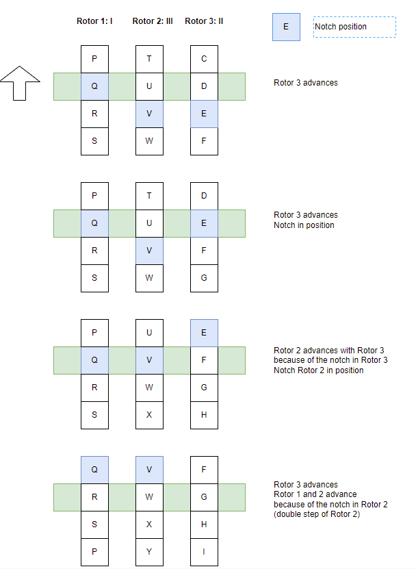

# enigma_c - Enigma simulation in C
## Introduction
### Purpose
This code simulates the **Engima M3** and **Engima M4** encryption machines the Germans used during WWII.

The [Engima Machine](https://en.wikipedia.org/wiki/Enigma_machine) is a mechanical/electrical device for encrypting and decrypting messages. It uses rotors (Walzen) and plugs (Steckers) for scrambling texts. The machine is set up by choosing rotors, rotor settings and placing up to 10 plugs, allowing for a large number of 'keys', each resulting in a unique encryption. There are several websites explaining how the machine works, like [Wikipedia](https://en.wikipedia.org/wiki/Enigma_machine).

I wrote this software to study the Enigma and try to crack its ciphers. It
is not meant as a user friendly program and requires C programming skills if you want to extend it for cracking your own ciphers. Furthermore, the user shall have some understanding about the working of the Enigma Machine.


Engima M3 (picture link from site https://www.stephenpeek.co.uk)

To show its workings, a lot of examples are provide which can be run from the menu. It is not intended as some stand alone end user tool. For this, there are plenty of tools online, for example [cryptii](https://cryptii.com/pipes/enigma-machine).


## Building
The software requires Linux and GCC. I also made it run under Windows using MinGW (MSYS2 UCRT64), Visual Studio Code and GCC. 

To build it, simply call 'make clean', 'make'.
It delivers a few executable files:
* **enigma**, which executes a number of examples and demos on request
* **test**, which execute module tests for the software
* **testPerformanceEngima** This runs the performance test of the software by executing 1.000.000 encodes/decodes for various cipher lengths. It takes various minutes, depending on your PC. It returns csv output to be processed, for example in MS Excel.
* **testPerformanceIoc** This performs an effectiveness test of the James Gillogly IoC method. It takes various hours. It returns the data to generate a similar diagram as is presented in the Gillogly whitepaper as csv output.

## Running
Run the tests as 
```
./test
```
This should result in a lot of output, ending with a summary like following (especially no tests failed):
```
INFO    ###############################################################################
INFO    # Tests Executed     : 39
INFO    # Tests Passed       : 39
INFO    # Tests Failed       : 0
INFO    # Assertions executed: 1449
INFO    ###############################################################################
```

Run the program as 
```
./enigma
```
Choose one of the examples by entering its number. For example **2** results in an encode decode cycle on the Engima M3 with random settings:

```
#####################################################################################
# ENIGMA M3 ENCODE/DECODE EXAMPLE - Random Settings
#####################################################################################
#####################################################################################
# Enigma settings
# Cipher/text               :
# TESTM ESSAG EENCO DEDON ENIGM AWITH RANDO MSETT INGS
# Cipher size               : 51 characters
# Number of Walzen          : 3
# Original Walzen           : UKW C, V, IV, II
# Original RingStellungen   : 10 8 6
# Original GrundStellungen  : 20 8 11
# Original Steckers         : ET GP FL XY IQ VM WK OU ND AZ
#####################################################################################
Original  : TEST MESSAGE ENCODED ON ENIGMA WITH RANDOM SETTINGS
Cipher    : YWCRHGFDIKALRGUGZJEZHMQPYDIRVAYLYXKTJQKRBKXF
Plain text: TESTMESSAGEENCODEDONENIGMAWITHRANDOMSETTINGS
```
## Usage of the software
### Basic Enigma
Next code example shows how to create an Enigma, configure it, encode/decode and destory it:
```    
    enigma=createEnigmaM3();
    setText(enigma, "RCGXFEAJCT");
    placeWaltze(enigma, 1, "I");
    placeWaltze(enigma, 2, "II");
    placeWaltze(enigma, 3, "III");
    
    placeUmkehrWaltze(enigma, "UKW B");
    
    setRingStellung(enigma, 1, 1);
    setRingStellung(enigma, 2, 17);
    setRingStellung(enigma, 3, 12);

    setGrundStellung(enigma, 1, 'A');
    setGrundStellung(enigma, 2, 'B');
    setGrundStellung(enigma, 3, 'C');
    
    placeSteckers(enigma, "bq cr di ej kw mt os px uz gh");
    
    encodeDecode(enigma);

    char* result=toString(enigma);

    printf("Result: %s/n", result);

    destroyEngima(enigma);
```    
Note that the rotors positions are numbered in the regular way from left to right, starting with 1 as shown below. Note that in *these interface functions* for the letters ASCII characters can be used (like 'A', 'B', 'C', ... 'Z', 'a', 'b', ... 'z') as well as digits (1, 2, ... 26).


In the code the internal representation is optimized for performance. Rotor numbering is the other way round (0 for the rightmost fastest rotor, numbering up to the left) and 0..25 for letters. Refer to the code for more information. Rotors are converted to look-up tables, so encryption/decryptions simply boils down to various array lookups.

TO DO: convert Ringstellung to change the lookup-tables in order to save more calculations during encryption/decryption. 

### EnigmaSettings structure
Settings of an enigma can be summarized in an EnigmaSettings instance. The Enigma can be programmed simply by

```
    Enigma* enigma=createEnigmaM3();
    EnigmaSettings* settings;

    // define settings
    
    setEnigma(enigma, settings);
    encodeDecode(enigma);
    result=toString(enigma);
    destroyEngima(enigma);
```

The method ```createRandomSettings()``` creates random settings by defining the Walzen set and the number of Steckers to use. You only have to copy the cipher to the structure.

```
    Enigma* enigma=createEnigmaM3();
    EnigmaSettings* settings=createRandomSettings(enigma, M3_ARMY_1938, 5);
    setEnigma(enigma, settings);
    strncpy(settings->cipher, cipher, MAX_TEXT-1);
    encodeDecode(enigma);
    result=toString(enigma);

    // do something with result

    destroyEngimaSettings(settings);
    destroyEngima(enigma);
```

Walzen sets to choose from:

* M3_ENIGMA1_1930 - 3 rotors (I, II, III) + 2 UKWs (UKW B, UKW C)
* M3_ARMY_1938    - 5 rotors (I, II, III, IV, V) + 2 UKWs (UKW B, UKW C)
* M3_ARMY_1939    - 8 rotors (I, II, III, IV, V, VI, VII, VIII) + 2 UKWs
* M4_NAVAL_1941   - 8 rotors (I, II, III, IV, V, VI, VII, VIII)+ 2 4th rotors (beta, gamma) + 2 thin UKWs (UKW B2, UKW C2)

Note that the latter set is the one and only that can be used on the Enigma M4.

## Performance
My first implementation was in Java (https://github.com/scubajorgen/enigma). Though nowadays Java is my favorite language, its performance was poor for some brute forcing because of the nature of the language. 
Therefore I wrote the software also in plain old C and optimized for performance. 

Next graph shows the time per encode/decode (i.e. just the decode when the machine has been set up), as function of the cipher size, in a **single thread** (and timing 10.000.000 decodes). I tested it on three machines: 
* low power N100 server running Linux (blue) 
* my desktop i5-9600k (6 cores) running Windows 10 (grey) 
* my Asus Notebook with an i5-12500H (12 cores, 16 virtual processors) running Windows 11 (red). 


For a 1000 character message a decode takes 22.3 μs on the N100, hence 44.800 decodes/s. The i5-12500H is the winner with 12.3 μs such a message, meaning 81.300 decods/s. All when executed in one thread. Like expected the performance increases linearly with the number of characters, no surprise here.

We can speed up things, by using multithreading, using the WorkDispatcher to offload the work to various threads. The effect of it is shown in next chart for a 1000 character message, on the i5-12500H (12 cores, 16 virtual processors).


Up till 4 threads performance increases linearly with the number of threads (4 threads deliver the same amount as 4 times 1 thread). Up till 10 threads we see another lineair increase, but at a less steeper rate. The maximum is reached with 21 threads: a stunning 608.000 decodes per second (=740% of one thread). Given 12 cores each running one thread, we would expect 1200% at 12 threads, but alas.

## Cracking ciphers: Turing method
### Principle
The software implements the method used by Alan Turing to crack the German encoded messages using 'the Bombe'. It assumes a piece of plain text (the crib) that corresponds to part of the cipher text. The software creates the letter links (the menu) and finds all loops in it (crib circles). It then finds the rotor settings and start position that fullfills the loops.
Refer to http://www.rutherfordjournal.org/article030108.html for a good description.

### Using the software for cracking ciphers
The Turing Bombe can be use to crack Enigma ciphers, if you have a guess of some plain text that matches part of the cipher.
```
    char* cipher                ="JKFDGNHJFHWGGBEFOEFB";
    char* crib                  ="SOMECRIBTEXT"
    TuringRecipe* recipe        =createDefaultTuringRecipe(cipher, crib, 0, 4);
    LinkedList* results         =linkedListCreate();
    turingBombe(recipe, results);
    // process results
    linkedListDestroy(results);
```
The software looks for the Rotor combination, the Grundstellungen and Ringstellung R3 (fastest Rotor) that results in the solution that fulfill Crib Cricles. Ringstellung R1 has no effect on decryption, so it is fixed. 
In most situations (short cribs) Ringstellung R2 has no effect, since the chance of movement of Rotor 1 is small. However in some situations it might. In these situations also take Ringstellung R2 into account:

```
    TuringRecipe* recipe        =createDefaultTuringRecipe(cipher, crib, 0, 4);
    recipe->startR2='A';
    recipe=>endR2='Z';
```

Note:
* Pass the cipher text and the crib as uppercase! 
* Crib length shall not exceed cipher text length. 
* Crib size should not exceed 26 characters or the loop number will explode. Space is not allocated dynamically, so arrays will get out of bounds
* The crib start must correspond to position of the cipher. If you know the position, enter it (in the example it is 0), if you do not know it, pass -1 and all positions that are valid are processed 
* Pass the number of threads to use (in the example 4) to distribute work over processor cores

The file testTuring.c contains quite a lot of examples.

### Inner workings of the software
Let us for example take ```testTuringBombe1()``` in ```test/testTuring.c```. It contains the crib 'WETTERVORHERSAGEBISKAYA' which corresponds to the cipher starting from position 0.

```
            0        1         2         3
Position    1234567890123456789012345678901234...
Cipher      RPVPZILDGRNOPPLOFZNRUALUGCBJFXYNJC...
Crib        WETTERVORHERSAGEBISKAYA
```

First the software creates all letter links with ```turingGenerateLetterLinks()```. For each letter it lists the letters it links to and the position. For example there is a link at position 14 between A and P.

```
Link A: 4 - P (14) U (21) Y (22) L (23)
Link B: 1 - F (17)
Link C: 0 -
Link D: 1 - O (8)
Link E: 4 - P (2) Z (5) N (11) O (16)
Link F: 1 - B (17)
...
```
Based on the links the function ```turingFindCribCircles()``` finds the crib loops. This is quite an extensive recursive function that calculates a set of crib circles for each letter. Basically, here the magic happens. In this example the first sets are:

```
SET A -   5
A ( 14) P (  2) E (  5) Z ( 18) I (  6) R (  9) G ( 15) L ( 23) A - size 8
A ( 14) P (  2) E ( 16) O ( 12) R (  9) G ( 15) L ( 23) A - size 7
A ( 14) P (  4) T (  3) V (  7) L ( 23) A - size 5
A ( 14) P ( 13) S ( 19) N ( 11) E (  5) Z ( 18) I (  6) R (  9) G ( 15) L ( 23) A - size 10
A ( 14) P ( 13) S ( 19) N ( 11) E ( 16) O ( 12) R (  9) G ( 15) L ( 23) A - size 9
SET B -   0
SET C -   0
SET D -   0
SET E -  10
E (  2) P (  4) T (  3) V (  7) L ( 15) G (  9) R (  6) I ( 18) Z (  5) E - size 9
E (  2) P (  4) T (  3) V (  7) L ( 15) G (  9) R ( 12) O ( 16) E - size 8
E (  2) P ( 13) S ( 19) N ( 11) E - size 4
E (  2) P ( 14) A ( 23) L ( 15) G (  9) R (  6) I ( 18) Z (  5) E - size 8
E (  2) P ( 14) A ( 23) L ( 15) G (  9) R ( 12) O ( 16) E - size 7
E (  5) Z ( 18) I (  6) R (  9) G ( 15) L (  7) V (  3) T (  4) P ( 13) S ( 19) N ( 11) E - size 11
E (  5) Z ( 18) I (  6) R (  9) G ( 15) L ( 23) A ( 14) P ( 13) S ( 19) N ( 11) E - size 10
E (  5) Z ( 18) I (  6) R ( 12) O ( 16) E - size 5
E ( 11) N ( 19) S ( 13) P (  4) T (  3) V (  7) L ( 15) G (  9) R ( 12) O ( 16) E - size 10
E ( 11) N ( 19) S ( 13) P ( 14) A ( 23) L ( 15) G (  9) R ( 12) O ( 16) E - size 9 
...
```
Note that the same circles occur for multipe letters, like:

```
A ( 14) P (  2) E (  5) Z ( 18) I (  6) R (  9) G ( 15) L ( 23) A
E (  2) P ( 14) A ( 23) L ( 15) G (  9) R (  6) I ( 18) Z (  5) E
```

This is deliberate, because in this way the same circle contributes to all sets when finding a solution *per set*.

Now it is simply finding a solution for Rotors, Ringstellungen and Grundstellungen for each set that fulfills the crib cirlces. The function ```turingFInd()``` cycles through all possibilities and for each possibility delegates to ```turingValidateHypotheses()``` to find a solution.


### Findings: Crib size and false positives
The software generated the Crib Circles for each letter: a set of crib circles for the letter 'A', a set for 'B', etc.

A solutions is created by finding the Rotors, Grundstellungen and Ringstellungen for which all Crib Circle Sets give an output that is consistent with the crib circles. To test this, for each set the software looks for a letter that result in it self when passing through all circles in the set.

It is not unusual to have false positives. 

* Short Cribs often lead to false positives in large number (thousands). Small Cribs may result in sets with only a few Crib Circles and/or short Crib Circles (e.g. A-V-A, E-I-E, K-M-K). Short circles have a lot of solutions.
* Large Cribs lead to exploding number of Crib Circles, terminating the software.
* The sweet spot lies around 20-30 characters. This results in some large crib circles of minimum length ~10.

Two functions have been made to detect and eliminate false positives.

* ```turingValidateTheSteckeredValues()```
  This function validates the found solution (the list of steckers). If there are inconsistencies, it means the found solution is a false positive. This is a quick check and is performed first.
* ```turingFindRemainingCribSteckers()```
  Only steckers are found for letters that are part of crib loops. This function tries to find steckers for the remaining letters in the crib. Basically this should succeed. If not, we have a false positive. Unfortunately this function can take a long time to execute.


### Performance
TBD


## Cracking ciphertext-only ciphers: Index of Coincidence - James Gillogly
### The method
In 1995 James J. Gillogly presented a paper ['CIPHERTEXT-ONLY CRYPTANALYSIS OF ENIGMA'](https://web.archive.org/web/20060720040135/http://members.fortunecity.com/jpeschel/gillog1.htm) in which he describes a method for cracking Enigma ciphers for which only the ciphertext is available.

Generally, computerized code cracking tries various permutations of the key (rotors, rotorsettings and plugs) and measures to what extent the result 'approaches' readable text. If you try all possible permutations, this is called 'brute forcing' and this takes an awful lot of time or might even be impossible. So you have to do better than that.

First of all we need a automatic measure that indicates whether deciphered text approaches readable text. For example:
* Count the number of 'e's in the text. The 'e' is the most common syllable (18% in English). The permutation which results in a number of 'e's above a limit of, say, 12% is a good candidate
* Index of Coincidence
* NGRAM scoring

James Gillogly presented a method for finding the rotor settings and the steckers using the '_Index of Coincidence_' (IoC).
It uses the fact that letter frequency in plain text isn't random. He uses the index of coincidence as measure of 'non-randomness'. Random text gives an IoC of 0.04, non random text (like "AAAAAAAA") gives an IoC of 1.0. German text gives a IoC of 0.08.

The Gillogly method consists of following subsequent steps:
1. Find the Waltzen and Grundstellung used that result in the largest IoC value, assuming a fixed Ringstellung of 1-1-1. It simply tries all permutations, perform a decryption and calculates the IoC.
1. Find the Ringstellung with the highes IoC value, first by varying the Ringstellung of Rotor 3, then of Rotor 2 (and changing the Grundstellung accordingly).
1. Find the steckers using a  'hill-climbing' technique.

The 1st step is the most time consuming. Number of permutations:
* Walzen: 5*4*3=60
* UKWs: 2
* Grundstellungen: 26x26x26=17576
* Total: 2.109.120 permutations

In this software the 2nd step has been improved. In the original method Ringstellung and Grundstellung are simply done not taking into account the inner workings of the Enigma. In this software the working of the Enigma is simulated when changing Ringstellung and Grundstellung (maybe Gillogly did it this way, but it was not described in his article).

See [the original article](http://web.archive.org/web/20060720040135/http://members.fortunecity.com/jpeschel/gillog1.htm) (it is enclosed in the /documents folder as well).
The method described and the original Gillogly cipher is implemented in the example 

```
    iocExample01Ioc();
```
Note that the Ringstellung of Waltze 1 has no meaning. R1 G1 results in the same decryption as R2 G2 as R3 G3, etc.

### Improvements
In the software the Gillogly method has been improved:
* At step 1, take not one candidate (that scores best) as _the_ solution, but take a number of best scoring candidates. Then execute step 2 on all found solutions. After step 2 it may occur that a lower places candidate gets to the top of the list.
* At step 1, also vary the Ringstellung of rotor 3. This takes much more time (26x) but it proves its value in combination with inline Stecker finding, to crack ciphers with up to 10 Steckers. It is also possible to vary Ringstellungen of 2 and 3, but I never used it. 
* At step 1 also take a number of Steckers into account (inline Stecker finding), exponentially increasing the time to solve (basically this is brute forcing)
* Use NGRAMs for step 1/2 and/or step 3 instead of IoC. Gillogly presents it as a better method for plug finding. For finding rotors NGRAMs is not effective. However for finding the plugs it is.

The software offers an automatic decoding with the function ```iocDecodeText()```. All the variations of settings can be described in a 'recipe'. In this way a cipher can be solved as follows

```
    IocRecipe recipe;
    char cipher[]="cipher";
    recipe.enigmaType       =ENIGMATYPE_M3;
    recipe.rotorSet         =M3_ARMY_1938;
    recipe.method           =DEPTH_NONE;
    recipe.evalWalzen       =EVAL_IOC;
    recipe.evalSteckers     =EVAL_IOC;
    recipe.maxSteckers      =10;
    recipe.maxSteckersInline=0;
    recipe.ngramSize        =0;
    strncpy(recipe.ngramSet, "none", MAX_NGRAMSETSIZE);
    recipe.scoreListSize    =52;
    recipe.numberOfSolutions=3;
    recipe.numberOfThreads  =6;

    setOperation(recipe);
    iocDecodeText(cipher, NULL);
```

The software calculates the permutations of rotors (when NULL is passed as second parameter), given the type of enigmaType and the rotorSet. Alternatively, the user can define his own permutations and provide it to iocDecodeText() (refer to example code ```message10_step01Limited()``` or test ```testCoincidenceDecodeTextInline2()```):

```
    iocDecodeText(cipher, permutations);
```


The work is distributed over multiple threads (6 in this example), taking advantage of multiple cores of the processor.


Following methods can be used
* DEPTH_NONE
  The orginal method as described above, keeping Ringstellungen at 1-1-1
* DEPTH_R3
  As above, but now the fastest Waltze 3 is also taken into step 1, at the 
  penalty of more time (26x) being consumed. It sometimes is more successful than the original method and has been proposed by Gillogly. 
* DEPTH_R2_R3
  As above, but now both Waltzen 2 and 3 are taken into step 1, removing the necesity for step 2. The penalty with respect to the original is 25x26x more time. It sometimes is more successful than the original method and has been proposed by Gillogly. 

Following evaluation methods can be used for rotor finding and plug finding:
* EVAL_IOC
  Evaluation based on Index of Coincidence
* EVAL_NGRAM
  Evaluation based on NGRAMs. Be sure to define ngramSize (1, 2, 3) and ngramSet ("GB" (English) or "DE" (German))

### Performance
First the performance. Next diagram shows the time for decoding and evaluation of the result with IoC.


The blue line shows the time for the plain decode as presented above. It is simply advancing the rotors for each character and looking up the decoded character.

The red line adds setting up the Enigma (Walzen, Ringstellungen, Steckers, ...) and reading out the result. The added time also slightly increases with number of characters in the cipher, since it includes creating the result as string (toString() function; the more characters, the more characters to copy).

The grey line adds the IoC calculation. We see that by far the calucalations for decode are the main component. Calculation of the IoC is relatively cheap.


### Findings
The implementation distributes the work over a number of threads, so the cores of multi core processors can be used to speed up the work by parallel processing. The original message from the Gillogly article is decrypted in **9 seconds** on a Core I5-9600 @ 3.7 GHz using method METHOD_IOC, using 6 threads.

The program ```testPerformanceIoc``` generates data to reproduce the effectiveness diagram in the original Gillogly paper. It is done by performing following steps

1. Choose text length (161, 316, 481, ... characters, like in the Gillogly paper)
    1. Choose number of plugs (0-12)
        1. Repeat 50 times
            1. Choose random exerpt of given length from original engima texts
            2. Choose random engima settings with given number of plugs (5 Walzen, 2 UKWs)
            3. Encode plain text into a cipher text
            4. Forget about the plain text and crack cipher text: find best solution
            5. Measure overlap between plain text and cracked cipher (percentage of characters that is the same in both)
        2. Calculate percentage (of 50 tries) for which overlap >80%

On the i5-9600k decryping 6 lengths x 13 plugs x 50 repetitions=3900 ciphers takes 6 hours and 9 minutes, using 6 threads. This means 5.7 seconds per crack on the average.


A remarkable observation is that when no plugs are used for encrypting or when the number of cipher characters is low, the step that find the plugs (using IoC) results in 'false positives'. These are plugs that reduce randomness but are not the right ones, decreasing the result! When we try to find the *exact number of plugs* that are really used for encryption (so when no plugs were used, we do not look for plugs) we find a better result. This corresponds better to the Gillogly graph. Of course, this is a bit 'cheating' because generally you do not know the number of plugs used for encryption.


For English text the method works even better as is shown in next graph.


The chance of finding the right solution decreases with the number of letters in the cipher, since randomness in the IoC become a factor, resulting in other solutions than the right one. Especially when the Ringstellung deviates much from 1-1-1. It may be worthwile to use DEPTH_R3 in such cases.
Assume Ringstellung R3=2 and Grundstellung G3=5 and you assume R3=1 you most probably will find G3=4. This gives almost the same result decryption result, however 1 out of 26 characters is wrong. Similarly if R3=3 and you assume R3=1 you find G3=3 and you end up with the decryption in which 2 out of 26 characters are wrong. In this way, the worst you can get is 13 out of 26 characters wrong, which is half of the text. The IoC than depends on the other half of the text which is right. By using DEPTH_R3, you cycle through all possibilities, also the one in which all characters are right.

### IoC vs NGRAMs
With IoC we measure non-randomness, assuming written language is less random than random text. We try to find permutations which maximizes IoC, hence which maximizes non-randomness. As we've seen this may result in false positives, for example when finding steckers.

As an alternative for finding the steckers a method that scores the decoded text using bigrams or trigrams or even multiple-grams (shortly: NGRAMs). A bi- or trigram is a combination of two respectively three letters. It appears that such letter combinations are characteristic for a language. The trigram 'the' appears quite often in English.

The method is described by [this article](https://cryptocellar.org/pubs/bgac.pdf). After finding the rotor settings and first steckers using the IoC method, the method succeeds better in finding the final steckers. 

It scores each trigram in the decoded text with the chance of this trigram occuring in average plain text. The more the decoded text approaches plain text, the higher the score. 

For example, the English text "THESE" consists of 3 trigrams, "THE", "HES" and "ESE". The scoring mechanism calculates the log of the chance that these trigrams occur in English text. Using the log has two advantages:
* Using the actual chances would result in extremely small chance values, resulting in underflow
* Using chance means the chance of occurrence of multiple trigrams means multiplication, using logs means addition. Addition is cheaper in terms of performance.

Next diagram shows the result for English text, where NGRAMs have been used for finding the plugs. 


Whereas the Gillogly requires large ciphers, this ngram method performs better for shorter ciphers or larger number of plugs. The method is implemented in ```ngramScore.c```.

## Code structure
Next diagram shows the source code structure


* **enigma** The actual Enigma machine simulation
* **ioc** The Gillogly IoC method for cracking ciphers
* **turing** The Turing Bombe
* **generics** Generic stuff like toolbox and logging, to be used everywhere
* **various** Forget about this
* **testframe** A simple test framework
* **test** Module tests
* **main** The main function for Enigma
* **test** The module tests run
* **testPerformanceEnigma** Enigma simulation performance tests
* **testPerformanceIoc** IoC Effectiveness tests


In green the core files
In purple the cracking methods
In grey internal files
In blue example and test files

### Inner workings
The green files in the picture above implement the Enigma simulation.

The current state of the machine is defined by the ```Enigma``` structure. Using the various functions in ```enigma.h``` an instance of this structure can be created, configured, used and destroyed.

The structure ```EnigmaSettings``` contain the startup settings of an Enigma. It can be used to configure an ```Engima``` instance using ```setEnigma()```. It can be used to easily reconfigure an Engima to the startup settings after a decryptions.

The main function is ```encodeDecode()```.

```
void encodeDecode(Enigma* enigma)
{
    int charIndex;
    
    charIndex=0;
    while (charIndex<enigma->textSize)
    {
        advance(enigma);

        enigma->conversion[charIndex]=encodeCharacter(enigma, enigma->text[charIndex]);
        
        charIndex++;
    }
}
```

It basically boils down to two functions: ```advance()``` to advance the Waltzen (which is done on the original Enigma on pressing a key) and ```encodeCharacter()``` for encoding/decoding a character of the text given the new rotor position (which is done on the original Enigma by lighting up a letter). The ```advance()``` and its opposite ```reverse()``` can be used to advance and reverse the rotors; these function also come in handy in various cracking algorithms. Both functions simulate the rotor movements including the 'double step' of the middle rotor, which is shown in the image below. 




